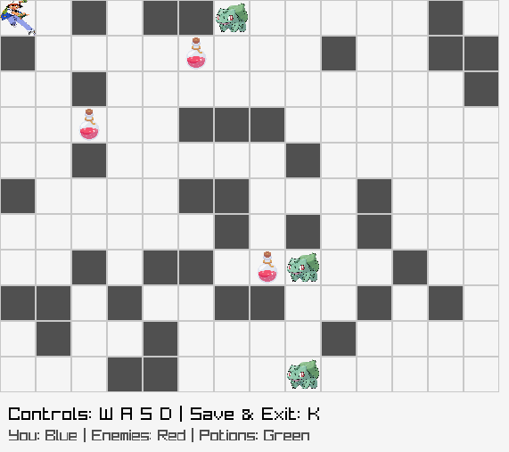
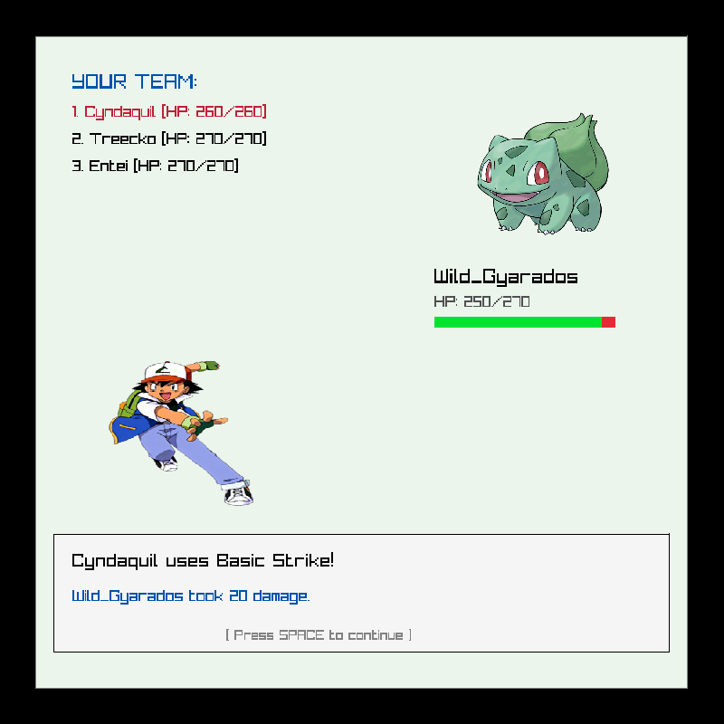

# Pokemon RPG

2D игра на C++ с raylib. Выпускной проект курса по C++ от DSR.

Ходишь по карте, дерешься с дикими покемонами, собираешь зелья и качаешь свою команду из 3 покемонов. Чтобы выиграть, надо победить всех врагов на карте.




## Что есть

- карта генерируется случайно, проходимость проверяется через BFS
- пошаговые бои
- уровни, эволюции (на 5, 10 и 15 уровне) и стихии
- сохранение и загрузка игры

## Управление

- `1` - новая игра, `2` - продолжить
- `WASD` - ходьба
- `1` `2` `3` - выбор покемона в бою, `Space` - дальше
- `K` - сохранить и выйти

## Сборка

Нужен CMake и компилятор с C++17. raylib скачается сама, если ее нет.

```
cmake -S . -B build
cmake --build build
```

Запускать из папки `build`, туда же копируются `assets` и `data`.
